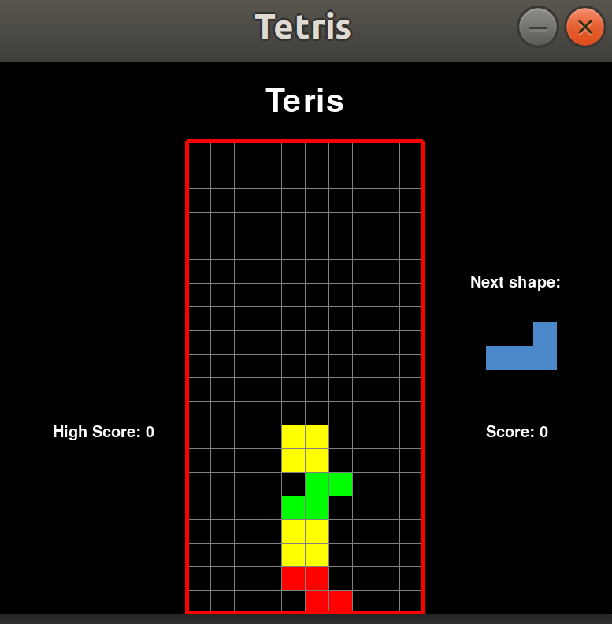

# Tetris
[Tetris](https://en.wikipedia.org/wiki/Tetris) is a tile-matching video game created by Russian software engineer Alexey Pajitnov in 1984. 
I am sure that you have played this game before. 

<p align="center">
  
</p>

This Tetris game is made by [pygame](https://www.pygame.org/news). 

# Try it and have some fun!
## How to run?
Please download the Git repository and run `Tetris_main.py`, then the gaming interface will show up. 

Note that you have to install `pygame`. Simply run:
```
python3 -m pip install -U pygame --user
```
, then you have `pygame` installed!

If you need more installation instruction, please check [here](https://www.pygame.org/wiki/GettingStarted). 

To run the code, simple type `python Tetris_main.py` in your terminal. 
You can also use your favorate IDE to execute the program. 

### Little surprise!
The dropping speed of the blocks will slowly increase as you play to bring this game more flavors!
How long can you handle? 
